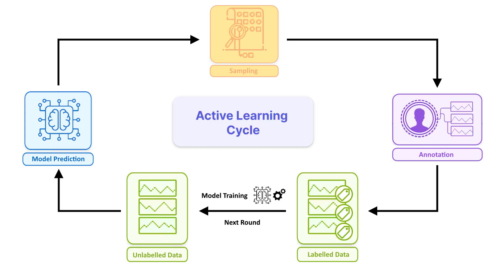

# Object Detection Active Learning

This module uses a technique known as **active learning**, in which a labeling model intelligently **selects which images should be annotated** along with their preliminary labeling. This allows this model to **learn from the most useful examples**, progressively improving its ability to generate reliable automatic labels and optimizing the resources dedicated to the annotation process. In this way, **quality datasets with relevant and diverse images** are generated that allow **robust and accurate AI models** to be subsequently trained.

## Overview

The active learning cycle is an **iterative process** with a set number of rounds, where the model progressively improves by selecting, labeling, and learning from the most informative samples in an unlabeled dataset, with the ultimate goal of building a high-quality labeled dataset for robust model training. Each round has the following stages:

- **Unlabelled data**: The cycle starts with an unlabelled dataset along with an initial detection model.

- **Making Predictions**: The model generates predictions on the unlabeled data, which will help later to identify samples where the model is uncertain.

- **Sampling Data**: Select the most informative samples from the unlabeled dataset. Labeling those samples will provide the greatest benefit for improving the models performance.

- **Annotation**: Human annotators label these selected samples, providing accurate labels and correcting any potential errors from the model's initial predictions.
  
- **Labelled Data**: Incorporate the newly labeled data into the training dataset, increasing its diversity and relevance.

- **Training the Model**: Retrain the model on the updated labeled dataset, enhancing its accuracy and robustness with each iteration of the cycle.

</a>

## Getting Started

First you need to clone the repository.

```bash
git clone REPO_LINK
```

<details open>
<summary>Install</summary>

Install the package on your active virtual environment:

```bash

python setup.py . # Install the package alongside its requirements
```

Alternatively you can install only the necessary requirements:

```bash
pip install -r requirements.txt # Only install the requirements
```

</details>

<details open>
<summary>CVAT Configuration</summary>

CVAT (Computer Vision Annotation Tool) is an open-source web-based tool for annotating images and videos, widely used for creating labeled datasets for computer vision tasks.

If access to a local installation of CVAT is not available, install it and run it from here [Local Cvat Installation](https://docs.cvat.ai/docs/administration/basics/installation/).

Create a .env file with your CVAT credentials:

```bash
FIFTYONE_CVAT_USERNAME=USERNAME
FIFTYONE_CVAT_PASSWORD=PASSWORD
FIFTYONE_CVAT_URL=CVAT_URL
```

</details>

<details open>
<summary>Usage</summary>

To set up an active learning workflow for object detection using this module you need to create an **ObjectDetectionActiveLearner** class instance. To do so you'll need a **FiftyOne dataset**, along with additional components like a **predictor** and **sampler**, which are imported and instantiated separately. Once everything is set up, the active learning process can be initiated by calling the **run_active_learning** method on the ObjectDetectionActiveLearner instance.

```python
from al_object_detection.active_learner.object_detection_active_learner import ObjectDetectionActiveLearner
from al_object_detection.object_detectors.yolov8_al_object_detector import YOLOv8_ALObjectDetector
from al_object_detection.samplers import UncertaintySampler, DiversitySampler, Sampler

import fiftyone as fo
dataset = fo.load_dataset("MY_DATASET")

# Predictor
predictor = YOLOv8_ALObjectDetector(model_path="./yolov8l.pt",
                                    model_config="./al_object_detection/config/yolo_config.toml")

# Sampler
uncertainty_sampler = UncertaintySampler()
diversity_sampler = DiversitySampler()
sampler = Sampler([uncertainty_sampler, diversity_sampler])

# Active Learner
al = ObjectDetectionActiveLearner(dataset, predictor=predictor, sampler=sampler)

al.run_active_learning()
```

If the active learning cycle is interrupted, you can resume the process by loading the previous state from the cache.

```python
al = ObjectDetectionActiveLearner.from_cache("./cache/MY_DATASET_al_state.pkl")
al.run_active_learning()
```

If you don't have a model to use during the active learning cycle you can create one using a zero-shot model as a base.

```python
from al_object_detection.model_initializers import ZeroShotModelInitializer, ZeroShot_ALObjectDetector
from al_object_detection.object_detectors.yolov8_al_object_detector import YOLOv8_ALObjectDetector
from al_object_detection.samplers import RandomSampler

import fiftyone as fo
dataset = fo.load_dataset("MY_DATASET")

# Zero-Shot model
zero_shot_model = ZeroShot_ALObjectDetector("./al_object_detection/config/owl2_config.toml")

# AL Model
al_model = YOLOv8_ALObjectDetector(model_path="./yolov8l.pt",
                                   model_config="./al_object_detection/config/yolo_config.toml")

# Sampler
random_sampler = RandomSampler()
sampler = Sampler([random_sampler])


al_initializer = ZeroShotModelInitializer(dataset=dataset,
                                          zero_shot_model=zero_shot_model,
                                          al_model=al_model,
                                          sampler=sampler)

al_initializer.run_model_initialization()

```

</details>

## Docs

- [fiftyone_basics](./assets/docs/fiftyone_basics.md)
- [cvat_basics](./assets/docs/cvat_basics.md)
- [object_detection_active_learner](./assets/docs/object_detection_active_learner.md)
- [samplers](./assets/docs/samplers.md)
- [object_detectors](./assets/docs/object_detectors.md)
- [model_initializers](./assets/docs/model_initializers.md)
